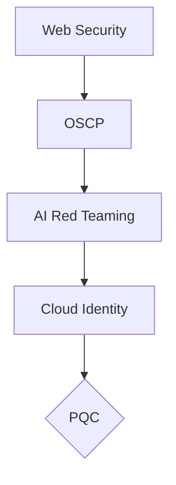

# *Welcome!*

> Started learning cybersecurity from **zero** — no Linux, no Bash, no Python. This is my public journey.

> Everything is documented: terminal logs, daily notes, reflections, and projects. every script, every lab, every mistake goes here.

> *Daily logs. Public projects. No shortcuts.*

>> Feel free to interact with any of the resources.

> **Open to feedback!**

> *Thanks for stopping by.*